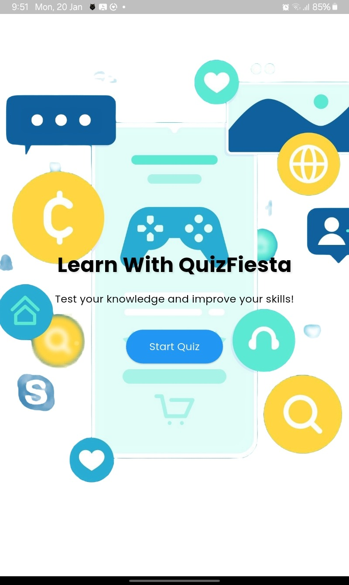
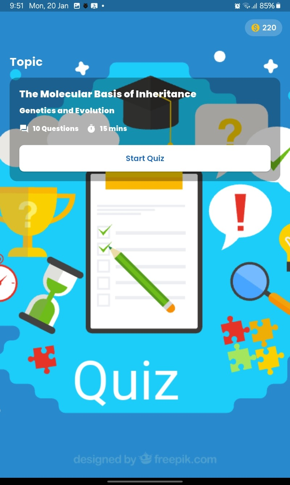
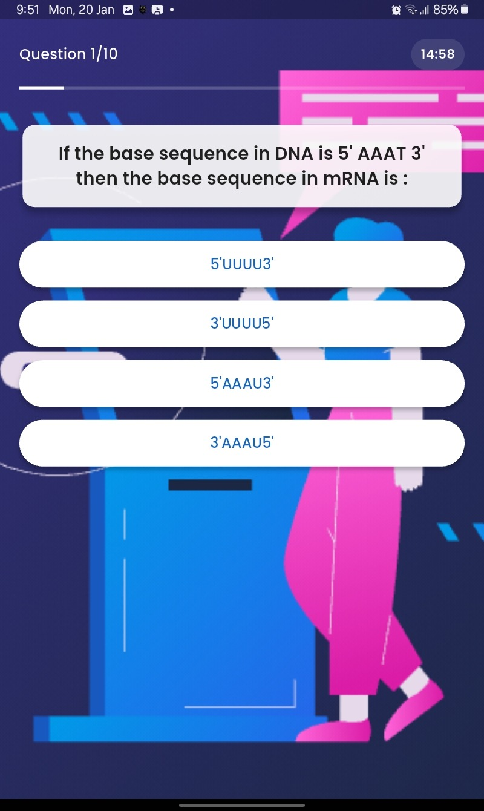
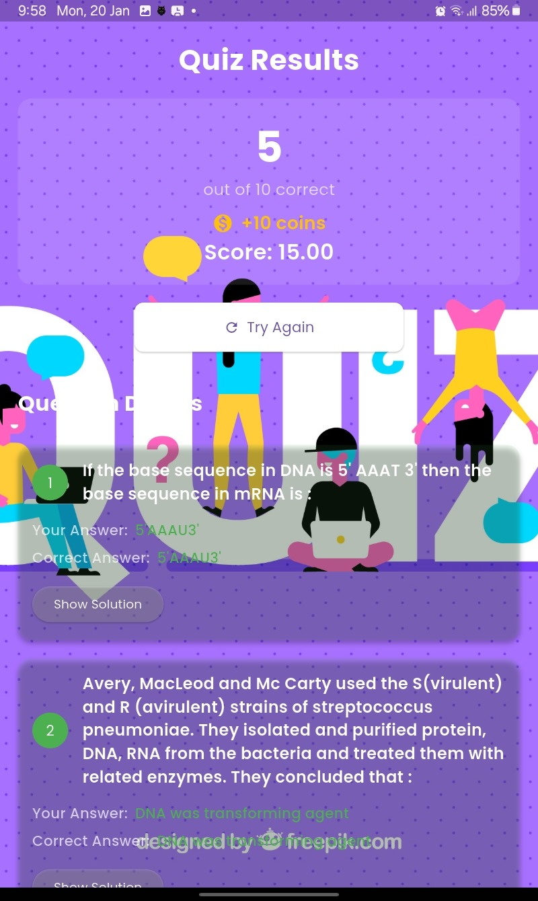

# QuizFiesta - Flutter Quiz Application

## Project Overview
QuizFiesta is an interactive quiz application developed as part of a technical assessment. The app demonstrates proficiency in Flutter development, focusing on API integration, state management, and engaging user experience through gamification.

## Key Features

### 1. Data Integration ✅
- Successfully integrated with API endpoint (https://api.jsonserve.com/Uw5CrX)
- Robust error handling for network issues
- Graceful error recovery with retry options

### 2. Core Functionality 🎯
- **Start Screen**: Clean and intuitive entry point
- **Quiz Flow**: Smooth navigation through multiple-choice questions
- **Results Summary**: Comprehensive display of quiz performance
- **Score Tracking**: Real-time point calculation

### 3. Technical Implementation 💻
- **State Management**: Implemented using Riverpod
- **Clean Architecture**: Well-organized code structure
- **Error Handling**: User-friendly error messages
- **Responsive Design**: Adapts to different screen sizes

### 4. Gamification Elements 🎮
- Coin-based reward system
- Progress tracking visualization
- Interactive feedback on answers

## Screenshots

  
  

  

  
  

  

## Project Structure